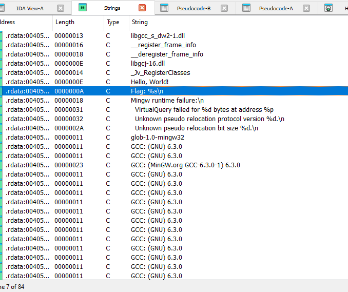
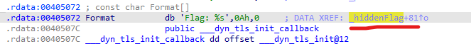
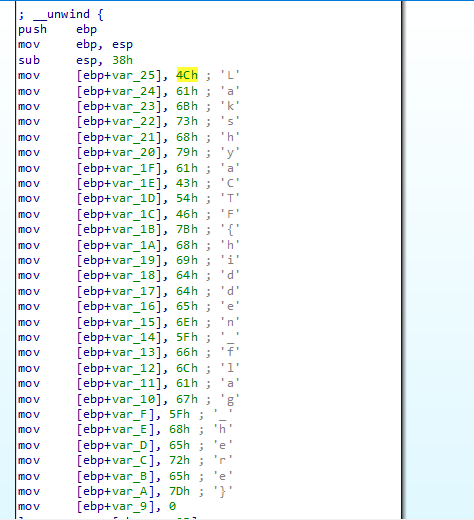

## HELLO WORLD! [250 points]

* Load in IDA Pro
* goto view > open subviews > strings
* you will se `Flag: %s` string reference > goto it

 * goto the xref address as shown in ss

 * you can see the hex to ascii as comments from ida (auto converter) 

**lol, theres our flag** : LakshyaCTF{hidden_flag_here}

PS: this is the easiest approach and wont work if proper encryption is used , thats why knowing dynamic analysis is always BETTER :))
