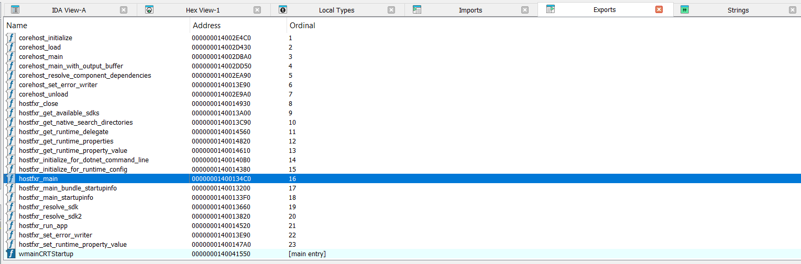
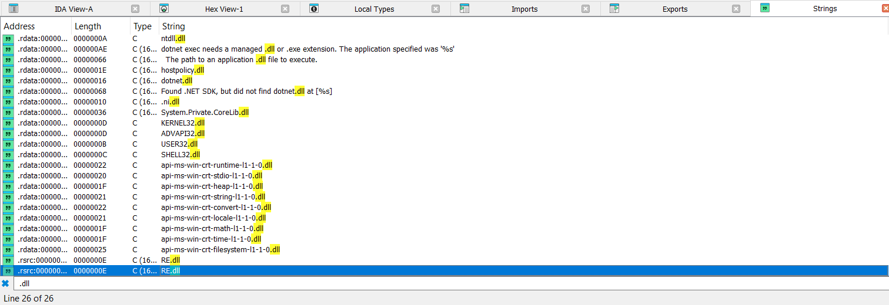
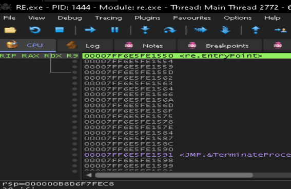
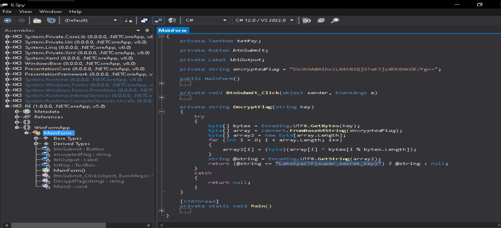

## FLAG EXTRACTION [600 points]

#### 1. loaded the executable in ida 
 * found several references to "hostfxr"
  
    as we know `hostfxr.dll` is part of the **.NET Core/.NET 5+ hosting layer**. It’s responsible for bootstrapping and initializing .NET Core applications. Think of it as the **runtime loader**.
  * and as it is a bundle means its self-contained app, you can often find the `.dll` of the main app near the `.exe`
  * so now we check strings for any EXTRA .dll resource

  * so now we load the app using `x64dbg` and pause at entrypoint (after loading any extra dll's)

  * open `%temp%/.net/RE/<random string>` folder and look at the extracted files you will find **RE.dll**

  * open the DLL in iLSpy

### lol , theres the flag [SUPER SIMPLE 600 points 🚀🚀]

PS: theres actually no need of doing this lengthy process, just run the exe and if it does not have extra remediation for cleanup.. you will already have all the extracted files to work with.
